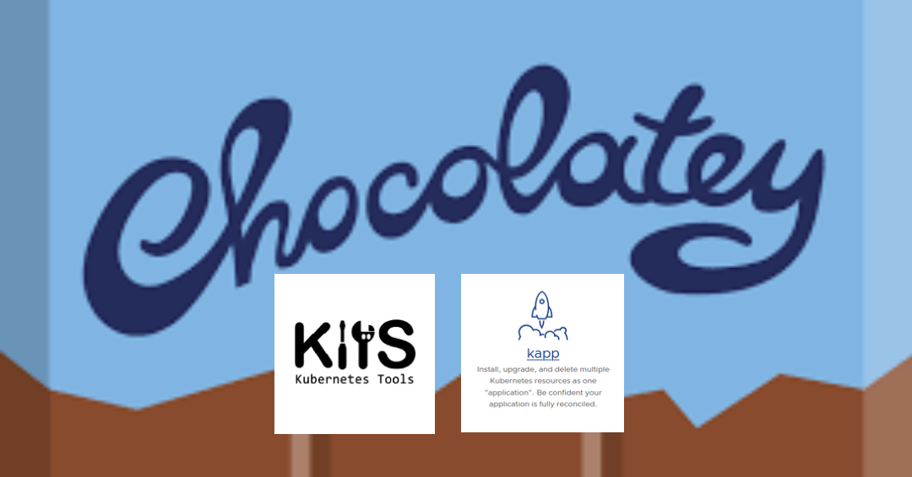

[](https://ci.appveyor.com/project/adriens/chocolatey-kapp)
[](https://chocolatey.org/packages/kapp)
[](https://chocolatey.org/packages/kapp)




# Usage

To install `kapp` and get an optimal experience on windows, just:

- [x] Follow classic choco [instructions](https://chocolatey.org/packages/kapp/) to install/upgrade
- [x] Install [ytt VS Code extension](https://marketplace.visualstudio.com/items?itemName=ewrenn.vscode-ytt)
- [x] :newspaper: Follow [carvel.dev on Twitter (formerly k14s)](https://twitter.com/carvel_dev)
- [x] :star: Star and follow [Carvel organization and repos](https://github.com/vmware-tanzu)
- [x] :book: Read the [VMWare Tanzu article that introduces k14s aka. Kubernetes Tools](https://tanzu.vmware.com/content/blog/introducing-k14s-kubernetes-tools-simple-and-composable-tools-for-application-deployment) why ytt has been created
- [x] :rocket:Discover [VMWare Open Source Program Office](http://vmware.github.io/)
- [x] :smiley_cat: Enjoy

# For developers only section

## Build locally


```
git clone https://github.com/adriens/chocolatey-kapp.git
cd chocolatey-kapp
choco uninstall kapp
choco install -fdv kapp.nuspec
```

:ballot_box_with_check: TODO section

[Not yet implemented CI](https://github.com/adriens/chocolatey-kapp/issues/2) so:

## Release check list


# For developers only section

## Build locally

```
git clone https://github.com/adriens/chocolatey-kapp.git
cd chocolatey-kapp
ant make
```
